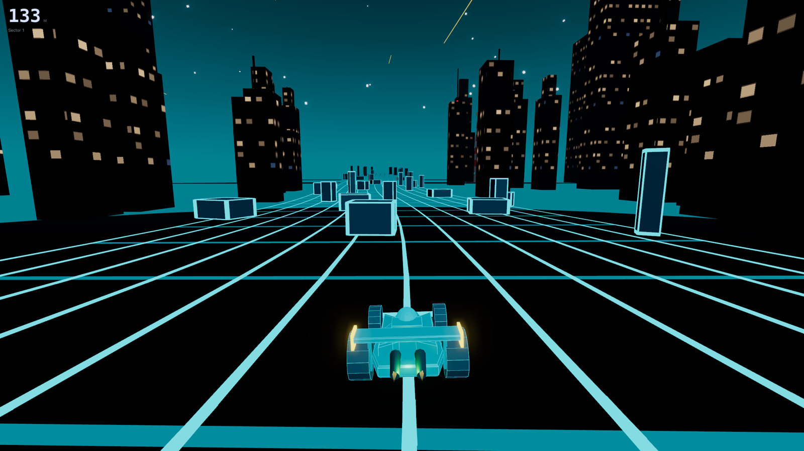
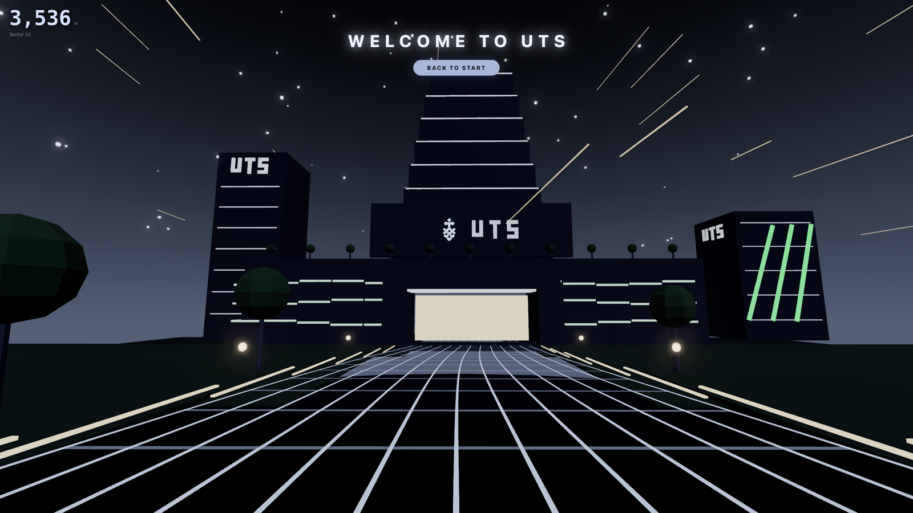

# WinterFell

**A WebGPU neon runner: twenty scenes, three and a half kilometres of track, and somewhere to arrive.**

[**▶ Play the live demo**](https://cg-winter-fell.vercel.app) · Steer with <kbd>A</kbd> / <kbd>D</kbd> or <kbd>←</kbd> / <kbd>→</kbd>. <kbd>Space</kbd> pauses.

<p align="center">
  <a href="https://cg-winter-fell.vercel.app">
    
  </a>
</p>
<p align="center">
  <a href="https://cg-winter-fell.vercel.app">
    
  </a>
</p>

## The run

It is a route, not a loop. Twenty scenes stand along it — a neon city, a beacon coast, a machine graveyard, a leviathan's ribcage — each owning 1800 units of track, with the palette and the speed turning over on the same stride. Speed ramps once across the whole route and then stops; there is no lap that outruns the player. Past the last scene the field ends, the track opens onto the UTS forecourt, and the craft comes to rest.

Score is distance survived, in metres. Every run draws its own seed, so the character of a stretch — slabs or spires, where the clear line generally sits, how long it commits before it turns — changes between runs while what the route is allowed to ask of you does not.

**Nothing is loaded from disk.** Every skyline, ridge, whale, turbine, block and letter is geometry built at runtime, and every sound is synthesised from oscillators. The repository ships no models, textures or audio files.

## Under the hood

- **One renderer, two backends.** Three's `WebGPURenderer` drives WebGPU where the browser has it, and its own WebGL2 backend where it doesn't — so both paths get the same picture.
- **Bloom is the look.** The halo, not the emissive material, is the effect. It's built on three's TSL node pipeline, which is why a plain `WebGLRenderer` was never an option: the fallback would have quietly lost the glow.
- **Instanced obstacles.** Body and glowing frame are two `InstancedMesh`es sharing one set of matrices — a whole section is two draw calls, generated from its index rather than stored.
- **A procedural route, not stitched formations.** Three continuous functions of world *z* decide what stands where, so there are no section seams to see.
- **Layouts are checked, not playtested.** A headless script walks the real generator with fresh seeds and asks whether a player at the game's own speeds could still reach somewhere safe — so "is this run winnable" is a measured property.
- **Benchmarks in the repo.** `bench/` holds Playwright probes for frame cost, GPU-buffer leaks, jank location and shader-compilation stalls.

## Try things

Opt-in URL flags, so a normal visit is unaffected.

| Flag | Effect |
| --- | --- |
| `?renderer=webgl` | Force the WebGL2 path even where WebGPU exists. |
| `?instancing=off` | Draw each block as its own mesh — the naive baseline. |
| `?immortal=1` | Ignore collisions and just fly the route. |
| `?craft=plane` | Fly the interceptor instead of the kart. |
| `?scenic=1&z=21600` | Sightseeing mode, starting this far along. Scene *n* begins at `(n - 1) * 1800`. |
| `?perf=1` | Collect frame stats into `window.__bench`. |

## Run locally

```bash
npm install
npm run dev
```

`npm run build` produces a production build and `npm run preview` serves it. `npm run dev:scenic` and `npm run dev:end` open straight into the ride and into the arrival.

## Stack

React 19 · TypeScript · Three.js (WebGPU) · React Three Fiber · Drei · Cannon · Zustand · Vite
